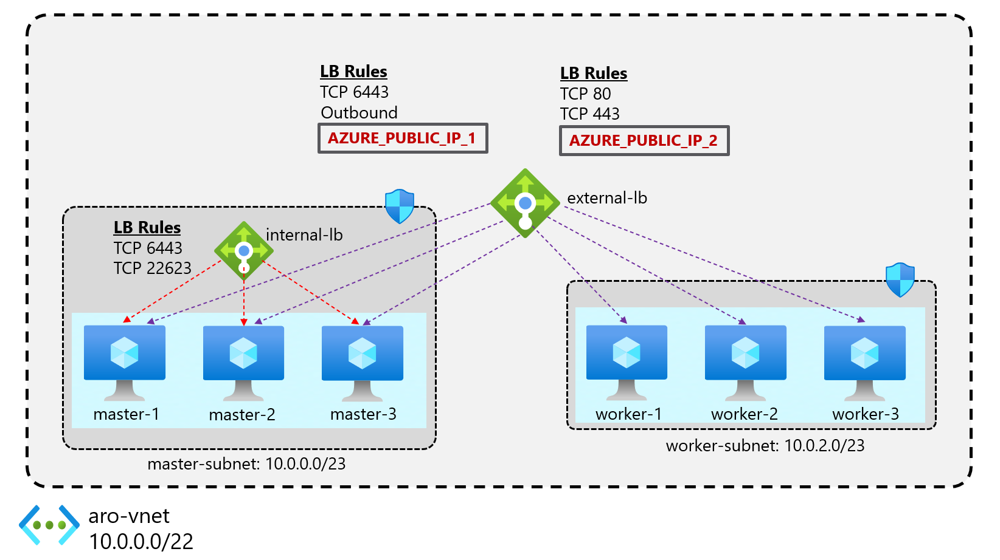

# Lesson 1: Create an Azure Red Hat OpenShift cluster

In this workshop lesson, you'll create an Azure Red Hat OpenShift cluster running OpenShift in an Azure subscription. You'll be using this cluster for the rest of the lessons in this workshop. Here's what we'll be completing in this lesson:

> * Setup the prerequisites 
> * Create the required virtual network and subnets
> * Create the ARO cluster

## Setup the prerequisites
### Prepare your Azure subscription
1. Before proceeding with the lesson, you need to have an Azure subscription with either the Owner role assignment OR the Contributor plus User Access Administrator role assignments

2. Azure Red Hat OpenShift requires a minimum of 40 cores to create and run an OpenShift cluster. The default Azure resource quota for a new Azure subscription does not meet this requirement. To request an increase in your resource limit, see [Standard quota: Increase limits by VM series](https://docs.microsoft.com/en-us/azure/azure-portal/supportability/per-vm-quota-requests?WT.mc_id=AZ-MVP-5003870)

### Register the resource providers
To successfully deploy the ARO cluster, you need to register the **"Microsoft.RedHatOpenShift"** resource providers. We will also ensure that the **"Microsoft.Compute"** and **"Microsoft.Storage"** resource providers are also registered.

1. Go to [Azure Cloud Shell](https://shell.azure.com) and sign in with your credentials

2. If you have multiple Azure subscriptions, specify the relevant subscription ID:

    ```
    az account set --subscription <SUBSCRIPTION ID>
    ```

3. Register the three resource providers:

    ```
    az provider register -n Microsoft.RedHatOpenShift -n Microsoft.Compute -n Microsoft.Storage --wait
    ```
## Create the required virtual network and subnets
Azure Red Hat OpenShift clusters require a virtual network with two empty subnets, for the master and worker nodes. In this section, we will create a resource group and then create a virtual network (containing the two empty subnets) for the ARO cluster.
### Create a virtual network containing two empty subnets

1. **Set the following variables in the shell environment in which you will execute the `az` commands.**
> [!NOTE] 
   > Azure Red Hat OpenShift is not available in all regions where an Azure resource group can be created. See [Available regions](https://azure.microsoft.com/en-gb/global-infrastructure/services/?products=openshift&regions=all) for information on where Azure Red Hat OpenShift is supported. Make sure you enter a supported location as your variable below.

   ```
   LOCATION=uksouth       # Modify this to the location that you want your cluster in
   RESOURCEGROUP=aro-workshop-rg   # the name of the resource group where you want to create your cluster           
   CLUSTER=arocluster        # the name of your cluster
   ```

2. **Create a resource group.**

   ```
   az group create \
     --name $RESOURCEGROUP \
     --location $LOCATION
   ```

2. **Create a virtual network.**

   Create a new virtual network in the same resource group you created earlier:

   ```
   az network vnet create \
      --resource-group $RESOURCEGROUP \
      --name aro-vnet \
      --address-prefixes 10.0.0.0/22
   ```

3. **Add an empty subnet for the master nodes.**
The subnet is created with a service endpoint connection to Azure Container Registry (ACR)
   ```
   az network vnet subnet create \
     --resource-group $RESOURCEGROUP \
     --vnet-name aro-vnet \
     --name master-subnet \
     --address-prefixes 10.0.0.0/23 \
     --service-endpoints Microsoft.ContainerRegistry
   ```

4. **Add an empty subnet for the worker nodes.**

   ```
   az network vnet subnet create \
     --resource-group $RESOURCEGROUP \
     --vnet-name aro-vnet \
     --name worker-subnet \
     --address-prefixes 10.0.2.0/23 \
     --service-endpoints Microsoft.ContainerRegistry
   ```

5. **[Disable subnet private endpoint policies](../private-link/disable-private-link-service-network-policy.md) on the master subnet.** This is required for the service to be able to connect to and manage the cluster.

   ```
   az network vnet subnet update \
     --name master-subnet \
     --resource-group $RESOURCEGROUP \
     --vnet-name aro-vnet \
     --disable-private-link-service-network-policies true
   ```

## Create the ARO cluster

```
az aro create \
  --resource-group $RESOURCEGROUP \
  --name $CLUSTER \
  --vnet aro-vnet \
  --master-subnet master-subnet \
  --worker-subnet worker-subnet
```
After executing the `az aro create` command, it normally takes about 35 minutes to create a cluster.

## What was deployed?
* An Azure AD app registration
* Resource group created
   * The master and worker nodes are contained here
   * The Azure AD App is granted the contributor role assignment to resource group
   * Three master nodes in the **"master-subnet"** (with 1TB Premium SSD OS disks)
   * Three worker nodes in the **"worker-subnet"** (with 128GB Premium SSD OS disks)
* An internal load balancer (with a private IP address)
* An external load balancer (with two public IP addresses)
   * The first public IP address is used to load balance TCP port 6443 to all nodes (it is also used for outbound connections from all nodes – masters and workers)
   * The second public IP address by default load balances TCP ports 80 and 443 to all nodes
* A private link service
   * Used for the private connection with the Azure Red Hat OpenShift services that manages the cluster
* A private DNS zone
   * *apps -> ingress path for externally available paths pointing to the second public IP of the external load balancer
   * This DNS zone is automatically linked to the virtual network



**For a more detailed description of the architecture, please refer to [this diagram](https://docs.microsoft.com/en-us/azure/openshift/media/concepts-networking/aro4-networking-diagram.png) and [this document](https://docs.microsoft.com/en-us/azure/openshift/concepts-networking)** 

## Next steps

In this lesson, you completed the following:
> * Setup the prerequisites required for your Azure environment
> * Create the required virtual network and subnets for the ARO cluster
> * Create the ARO cluster

Proceed to the next lesson:
> [Connect to the ARO cluster](2-connect-aro-cluster.md)
