# Lesson 3: Configure Azure AD authentication for ARO

In this workshop lesson, you'll configure Azure Active Directory authentication for your ARO cluster using the Azure portal and the OpenShift web console. Here's what we'll be completing in this lesson:

> * Create an Azure AD App for authentication
> * Configure Open ID Connect authentication in the ARO cluster web console
> * Verify login to the ARO web console as an Azure AD user

## Create the Azure AD app for the ARO cluster
1. Construct the ARO cluster's OAuth callback URL and make note of it.
```
domain=$(az aro show -g $RESOURCEGROUP -n $CLUSTER --query clusterProfile.domain -o tsv)

location=$(az aro show -g $RESOURCEGROUP -n $CLUSTER --query location -o tsv)

oauthCallbackURL=https://oauth-openshift.apps.$domain.$location.aroapp.io/oauth2callback/AAD

echo $oauthCallbackURL
```
* Make a note of the `oauthCallbackURL` value

2. Create an Azure Active Directory application for authentication and copy the app ID.
* Do this in the [Azure Cloud Shell](https://shell.azure.com)
* Replace the `<complex_password>` placeholder with a complex password for the app
```
appname="aro-auth"
apppassword="aA+twPsYTwaRJwscYU+N@^c#7@5rScF3Xv"
```
```
appID=$(az ad app create \
  --query appId -o tsv \
  --display-name $appname \
  --reply-urls $oauthCallbackURL \
  --password $apppassword)
```
```
echo $appID
```
* Copy the output app ID as you will need this in a later task

3. Obtain the tenant ID
```
tenantID=$(az account show --query tenantId -o tsv)
```
```
echo $tenantID
```

4. Configure optional claims
* Application developers can use optional claims in their Azure AD applications to specify which claims they want in tokens sent to their application.
* We can use optional claims to:
   * Select additional claims to include in tokens for your application.
   * Change the behavior of certain claims that Azure AD returns in tokens.
   * Add and access custom claims for your application.
* We'll configure OpenShift to use the email claim and fall back to upn to set the Preferred Username by adding the upn as part of the ID token returned by Azure Active Directory.

* Navigate to Azure AD → App registrations → All Applications → Select the app that was created aro-auth
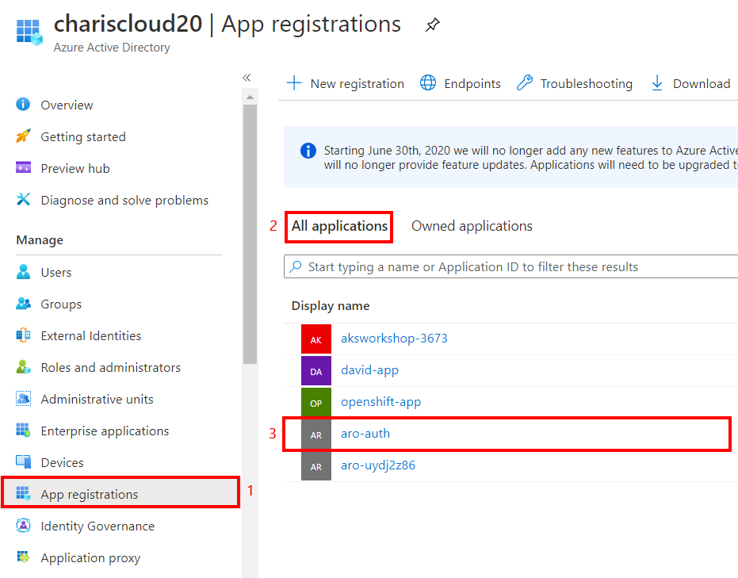

* Click on Token configuration → Add optional claim
   * **Token type**: ID
   * **Claim**: Select both **email** and **upn**
   * Click **Add**
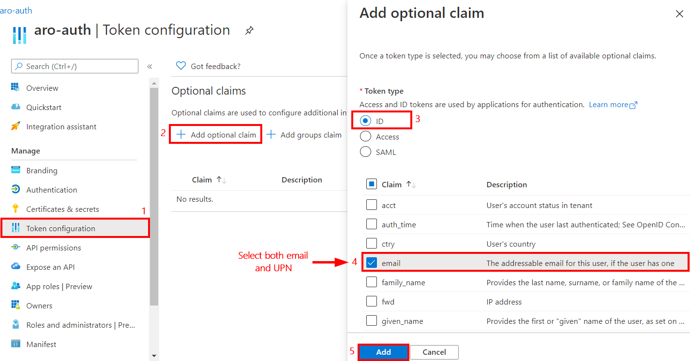

* In the **Add optional claim window**, select **Turn on the Microsoft Graph email, profile permission (required for claims to appear in token)** and click **Add**
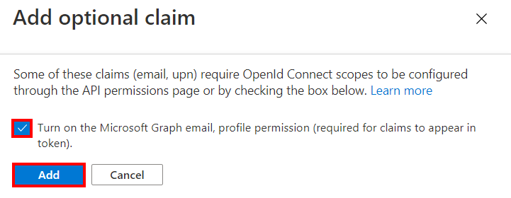


5. Assign users and groups to the cluster (optional)
* Applications registered in an Azure Active Directory (Azure AD) tenant are, by default, available to all users of the tenant who authenticate successfully. Azure AD allows tenant administrators and developers to restrict an app to a specific set of users or security groups in the tenant.
* Follow the instructions on the Azure AD documentation to [assign users and groups to the app](https://docs.microsoft.com/en-us/azure/active-directory/develop/howto-restrict-your-app-to-a-set-of-users#app-registration).

## Configure OpenShift OpenID authentication in the cluster web console

1. **Retrieve the kubeadmin credentials and the cluster console URL**
   ```
   LOCATION=uksouth       # the location of your cluster
   RESOURCEGROUP=aro-workshop-rg   # the resource group of your cluster that you created in the last lesson           
   CLUSTER=arocluster        # the name of your cluster
   ```
```
kubeadminpass=$(az aro list-credentials \
  --name $CLUSTER \
  --resource-group $RESOURCEGROUP \
  --query kubeadminPassword -o tsv)
```
```
echo $kubeadminpass
```
* Make a note of the kubeadmin password
```
 consoleURL=$(az aro show \
    --name $CLUSTER \
    --resource-group $RESOURCEGROUP \
    --query "consoleProfile.url" -o tsv)
```
```
echo $consoleURL
```
* Make a note of the cluster console URL

2. **Launch the console URL in a browser and login using the `kubeadmin` credentials.**
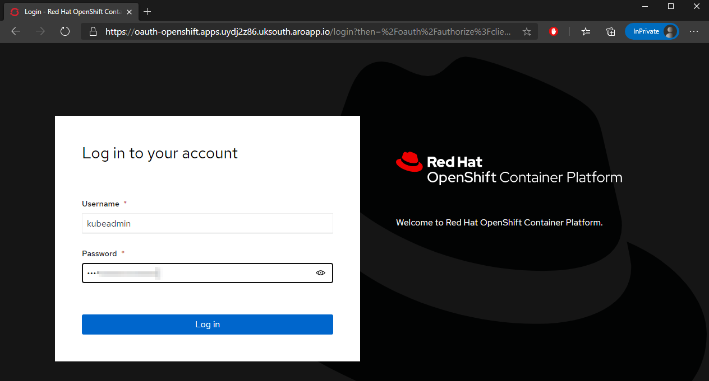

3. Navigate to **Administration**, click on **Cluster Settings**, then select the **Global Configuration** tab. Scroll to select **OAuth**.
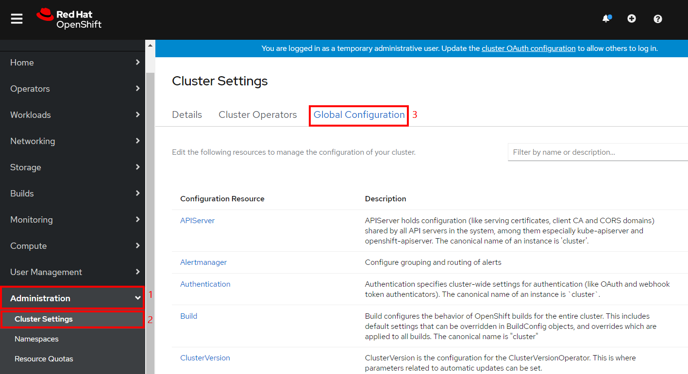

4. Scroll down to select **Add** under **Identity Providers** and select **OpenID Connect**.
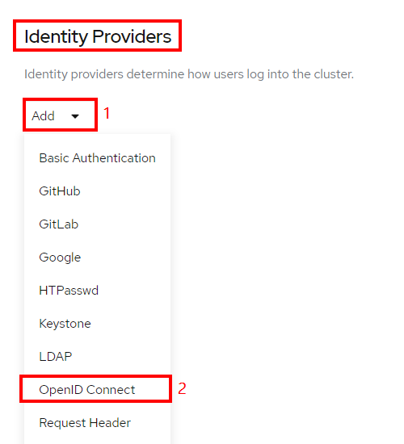

5. Fill in the following information:
* **Name**: **AAD**
* **Client ID**:  The Azure AD application ID that you recorded earlier
* **Client Secret**: The Azure AD application password
* **Issuer URL**: `https://login.microsoftonline.com/<tenant-id>`. Replace the placeholder with the Tenant ID you retrieved earlier.
* **Claims**:
   * **Preferred Username**: upn
* Leave other settings as they are
* Scroll down and click on **Add**

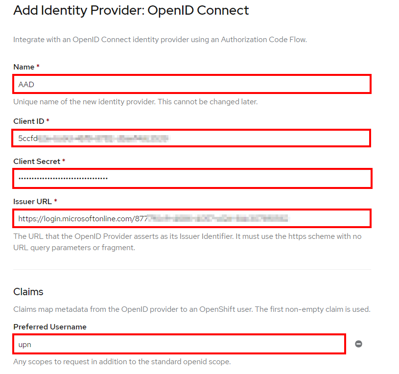 

## Verify login through Azure Active Directory

1. Logout of the OpenShift Web Console and try to login again, you'll be presented with a new option to login with **AAD**. 
* You may need to wait for a few minutes.
* Follow the login flow as shown below.


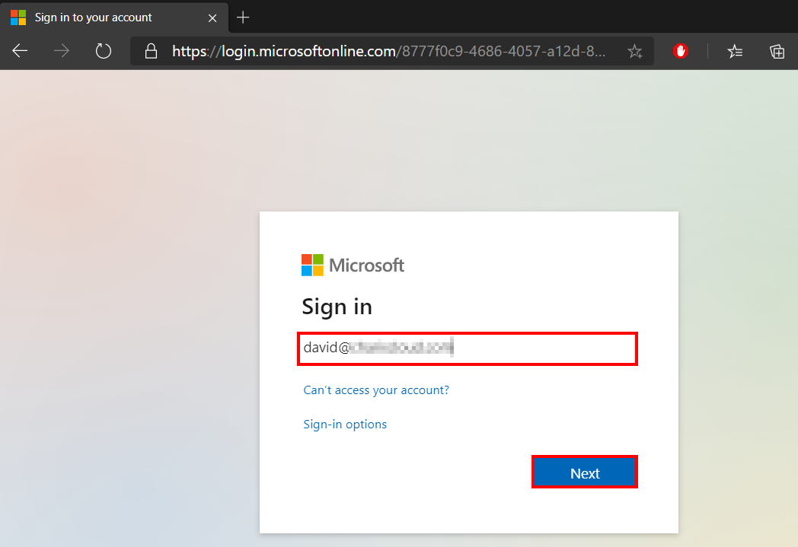

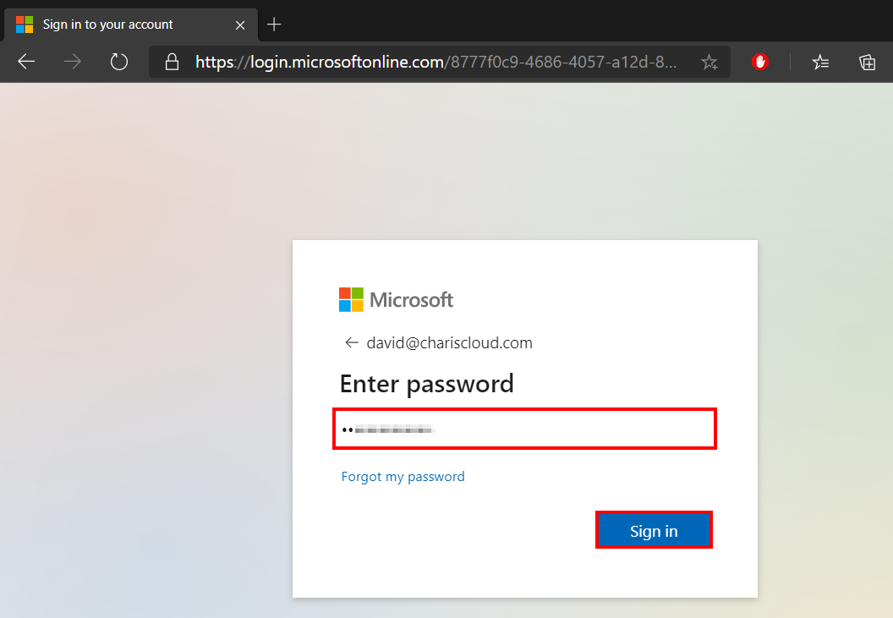

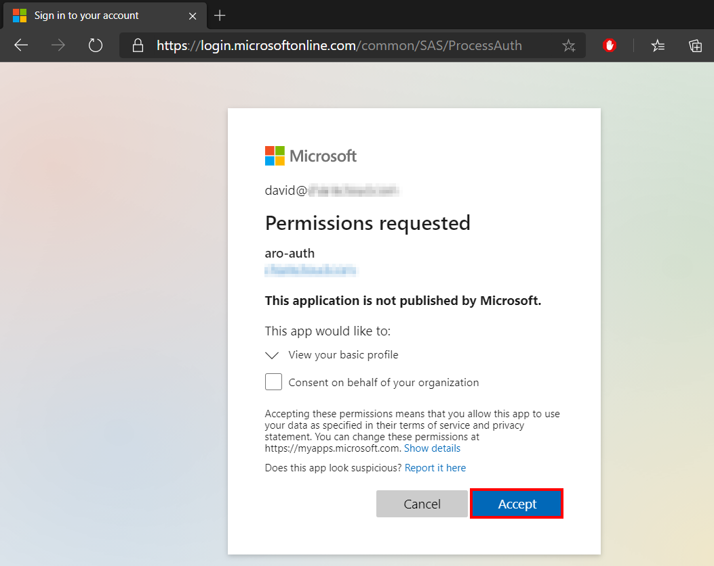

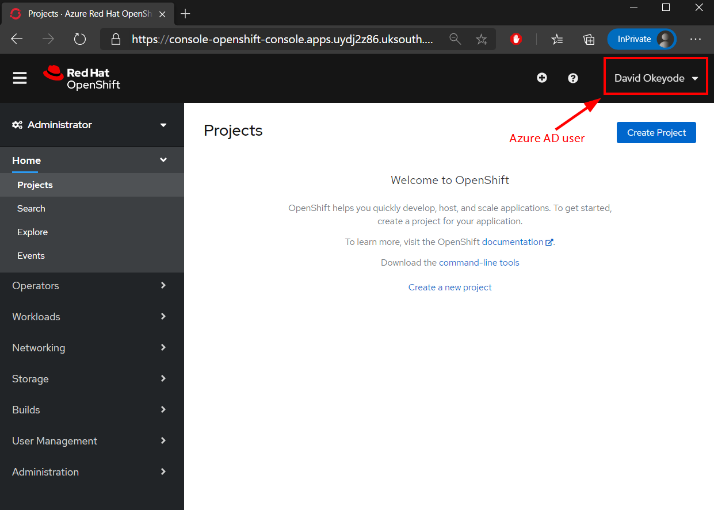
## Next steps

In this lesson, you completed the following:
> * Created an Azure AD App for authentication
> * Configured optional claims for the Azure AD app
> * Configured Open ID Connect authentication in the ARO cluster web console
> * Verified login to the ARO web console as an Azure AD user

Proceed to the next lesson:
> [Implement a Go Microservices project](4-aro-go-microservices.md)
